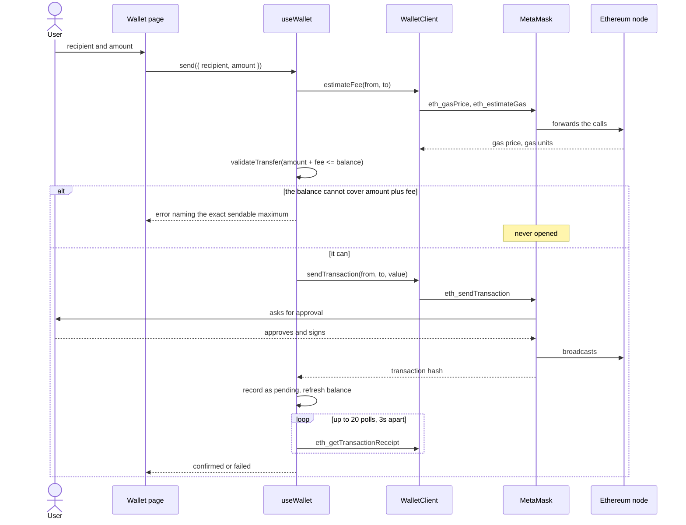
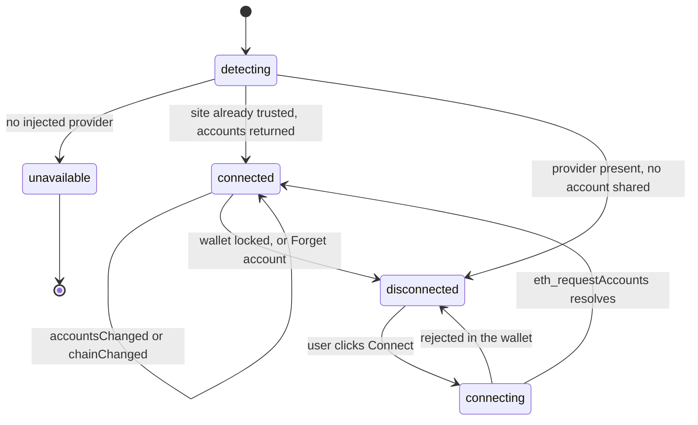

# DeFiGuard

An Ethereum wallet screen in the browser: connect an injected EIP-1193 wallet such as
MetaMask, see the account, its balance and the chain it is on, send ETH, and keep a local
record of the sends made from here. It sits at `/wallet` inside a small React marketing
site, and a separate Express API ships alongside it.

No private key, seed phrase or mnemonic exists anywhere in this repository. Transfers go
out through `eth_sendTransaction`, which hands an **unsigned** transaction to the
extension; the signing happens in the wallet, after the user approves it.


## Pricing the transfer before validating it

`amount <= balance` is the wrong question. A user who types their whole balance passes
that check, approves in MetaMask, and then watches the node reject the transaction for
being unable to pay for its own gas. The question is `amount + fee <= balance`, and the
fee has to be fetched before the form can be judged — so the estimate comes first and
validation comes second.



The refusal names the number the user can actually send, rather than telling them to try
something smaller. In the capture below the account holds 3.748500 ETH and the estimate is
21000 gas at 24 gwei, so 0.000504 ETH is reserved and 3.747996 ETH is what fits.


Everything that decides this lives in `src/lib/wallet/amount.js`, which is pure: it takes
strings and BigInts and returns a verdict. Amounts are parsed as a plain decimal with at
most 18 places — `1e18`, `1.2.3`, `0` and negatives are each rejected with their own
message — and wei is converted for display with integer string maths, never through a
float, so a dust balance renders as `<0.000001` rather than a flat `0.0000`.

## Connection states

The hook exports the lifecycle explicitly (`WALLET_STATUS`) so the page never has to infer
it from a scatter of booleans. There is no `connected` flag to get out of step with an
`account` string.



`accountsChanged` and `chainChanged` are subscribed to rather than read once. Switching
account in MetaMask re-adopts the new one and reloads its balance; switching network
renames the badge on screen. Sending on a chain you did not think you were on is the
expensive mistake in an interface like this, so the chain is always visible and testnets
are labelled as such.

`Forget account` clears local state only, and says so — a dapp cannot revoke its own
permission, and a button implying otherwise would be a lie.

Sends made from this page are logged to `localStorage`, scoped to one account on one
chain and capped at 25 entries. A submitted transfer is recorded as pending and resolved
to confirmed or failed from its receipt.


## The provider seam

`WalletClient` takes an EIP-1193 provider and speaks raw JSON-RPC to it. Nothing above the
client knows whether that object is MetaMask, a WalletConnect session or a fake, which is
the one abstraction in the front end that pays for itself immediately: it is what lets the
shipped page, hook and client be driven end to end in jsdom with nothing inside the
application mocked.

It is also how the screenshots above exist. `scripts/capture-screenshots.mjs` injects a
fake provider with Playwright's `addInitScript` before any application code runs, then
drives the real UI at 1440x900. The two rows in the history table were produced by filling
in and submitting the form; they were not seeded.

web3.js is kept for exactly one job — `Web3.utils.isAddress`, because checksum validation
needs keccak. Balances and amounts never go near it.

## What every visitor downloads

The marketing pages have no use for web3.js, so `/wallet` is a `React.lazy` route and web3
lands in its own chunk. Measured with `npm run build`, gzip figures as CRA reports them:

| Chunk | gzip |
| --- | --- |
| `main` — every visitor | 133.5 kB |
| web3.js chunk — only on `/wallet` | 137.12 kB |
| `main` CSS | 35.69 kB |
| `build/static/media` (all emitted assets) | 488 kB |

The four icons on the site are inline SVG rather than an icon font, which is the other
reason there is no webfont payload.

## Running it

```bash
npm install
cp .env.example .env     # optional; the API runs without it
npm start                # API on :3003, web app on :3000
```

Open <http://localhost:3000/wallet>. With no wallet extension installed the page says
"No Ethereum wallet found" and links to the MetaMask download, rather than rendering a
dead Connect button.

Front end only: `npm run start-front`. API only: `npm run start-server`.

```bash
npm test             # both suites
npm run test:web     # React and wallet domain
npm run test:server  # API, over supertest and in-memory repositories
npm run lint         # eslint, --max-warnings 0
npm run format       # prettier --check
npm run build        # production bundle
```

`npm test` runs the two suites in sequence, because `react-scripts test` only looks inside
`src/` and the API has its own Jest config:

```
Test Suites: 7 passed, 7 total
Tests:       105 passed, 105 total

Test Suites: 4 passed, 4 total
Tests:       67 passed, 67 total
```

No test in either suite makes a network request, opens a database, or is capable of
signing or broadcasting a transaction. The fake provider in `src/lib/wallet/testing/` has
no key material and no transport.

Re-capturing the screenshots needs a Chromium build for Playwright:

```bash
npx playwright install chromium
npm run start-front                    # leave running
PORT=8650 node scripts/capture-screenshots.mjs
```

## Environment variables

All of them are read in `server/config/index.js`, and none has a secret as its default.
The wallet itself needs no configuration at all: it uses whatever chain the user's own
wallet is connected to, so there is no RPC URL to set and no key to supply.

| Variable | Required | Default | Purpose |
| --- | --- | --- | --- |
| `API_PORT` | no | `3003` | Port the API listens on. Prefer this over `PORT`: `npm start` runs the React dev server in the same shell and `react-scripts` reads `PORT` too. |
| `PORT` | no | `3003` | Fallback for `API_PORT`, and the port `react-scripts` serves on. A non-numeric value fails at startup rather than listening on `NaN`. |
| `MONGO_URL` | no | _(unset)_ | MongoDB connection string. Unset means in-memory storage: every route works, nothing survives a restart. |
| `JWT_SECRET` | for auth | _(unset)_ | Signs and verifies JWTs. Deliberately has no fallback — without it the authenticated routes answer `503` instead of signing with a guessable development key. |
| `JWT_EXPIRES_IN` | no | `1d` | Token lifetime, in the format `jsonwebtoken` accepts. |
| `CORS_ORIGIN` | no | `http://localhost:3000` | Comma-separated list of browser origins allowed to call the API. |
| `BCRYPT_ROUNDS` | no | `10` | bcrypt work factor. |
| `STATIC_DIR` | no | _(unset)_ | Directory holding the built SPA. Set to `/app/build` in the container image so one process serves both halves. |
| `NODE_ENV` | no | `development` | Standard Node environment flag. |

## The Express API, and what it is not

`server/` is an account and messaging API — register, log in, list users, set an avatar,
exchange messages over Socket.IO. **The wallet page never calls it.** It is not part of
any flow on this site, and the marketing pages are static.

What it is, taken on its own terms: `server/app.js` builds the Express app with no
`listen()` and every collaborator injectable, `server/index.js` is process wiring only.
Controllers are thin HTTP adapters, services hold the rules, and repositories have a
Mongoose implementation and an in-memory one behind a single interface — which is what
makes `MONGO_URL` optional rather than fatal, and what lets all 67 API tests run over
supertest with no database. Identity on authenticated routes comes from a verified bearer
token, not from a URL parameter, and responses are built from an explicit public
projection so a password hash cannot ride along in one. Reads are paged with the page size
clamped server-side rather than trusted from the request.

A real captured session — `/health`, register, duplicate register, `/me` with and without
a token, paginated users, an unknown route — is in
[`docs/api-session.txt`](docs/api-session.txt), verbatim.

The site the wallet lives in is a purchased blockchain-agency template; its copy, team and
blog entries are the template's placeholder content.


## Where things live

```
src/
  lib/wallet/            The wallet domain. No React, no components.
    walletClient.js      EIP-1193 adapter — the seam a new provider plugs into
    metaMask.js          Detects window.ethereum and wraps it
    amount.js            Amount grammar and the amount-plus-gas rule, in BigInt
    format.js            wei -> display strings, never via a float
    networks.js          chain id -> name, testnet or not
    history.js           The bounded local log, scoped per account and chain
    testing/             Fake provider and memory storage, for tests and screenshots
  hooks/useWallet.js     Lifecycle, provider events, receipt polling
  pages/wallet/          The wallet screen — presentation only
  pages/, components/    The marketing site
  components/icons/      The four icons, inline SVG

server/
  app.js                 Builds the Express app; no listen(), fully injectable
  index.js               Process wiring: config, database, sockets, shutdown
  config/                Every environment-dependent value, in one place
  routes/ controllers/   Route tables; request in, service call, status code out
  services/              The business rules
  repositories/          Mongoose and in-memory implementations of one interface
  models/ db/            Mongoose schemas and the optional connection
  middleware/            Auth guard, async wrapper, terminal error handler
  realtime/presence.js   Socket.IO presence and relay
  __tests__/             Supertest-driven API tests

docs/                    Captured screenshots and the API transcript
scripts/                 The Playwright screenshot capture
```

[`WALLET_README.md`](WALLET_README.md) traces the original brief's feature list against
what is implemented now.

## Out of scope

- **No QR code.** The receive card shows the address and a copy button.
- **ETH only.** No ERC-20 transfers, no token balances, no contract calls. This is a
  transfer screen, not a DeFi client.
- **The history is this browser's, not the chain's.** It records sends made from this
  interface. Transfers made anywhere else never appear, and clearing site data clears it.
- **Legacy gas only.** Transfers carry `eth_gasPrice` and a gas limit, not an EIP-1559
  `maxFeePerGas`/`maxPriorityFeePerGas` pair. Wallets fill those in, so transfers succeed,
  but the figure in the shortfall message is a legacy-style estimate.
- **The Mongoose repositories are not integration-tested.** The interface is exercised
  through the in-memory implementation; the Mongoose side is structurally simple but has
  not been run against a real MongoDB here.
- **The contact form does not send mail.** It acknowledges the submission in place and
  says so.
- **CRA 5 is end-of-life.** Migrating to Vite would touch every file and was not attempted.

## In a container

```bash
JWT_SECRET=$(node -e "console.log(require('crypto').randomBytes(48).toString('hex'))") \
  docker compose up --build
```

Four stages — dependencies, React build, production dependencies, runtime — so the
shipped image carries no `react-scripts`, no webpack and no test tooling. It runs as the
unprivileged `node` user under `tini`, so `SIGTERM` reaches the graceful shutdown in
`server/index.js`, and carries a `HEALTHCHECK` against `/health`. Compose publishes the
app on <http://localhost:8650> and keeps MongoDB off the host entirely; `JWT_SECRET` is
required with no default.

**These images have not been built or booted in this environment.** `docker compose
config -q` parses cleanly; that is the extent of what has been verified.

## Licence

Apache-2.0. See [LICENSE](LICENSE).
