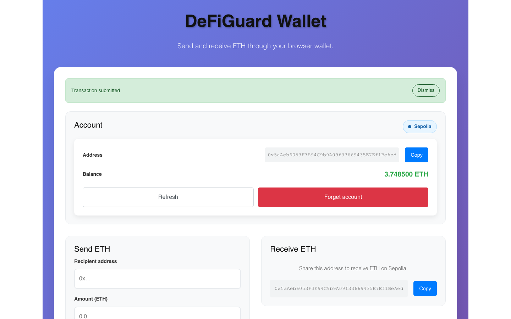
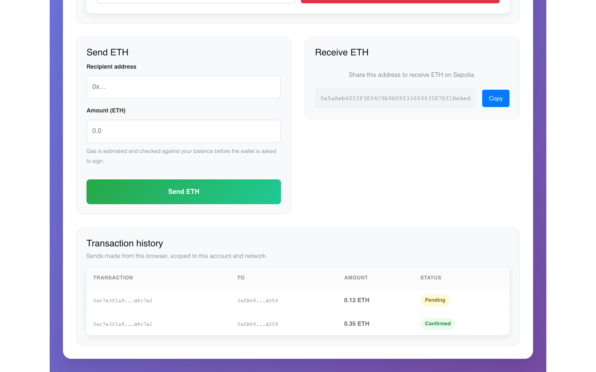
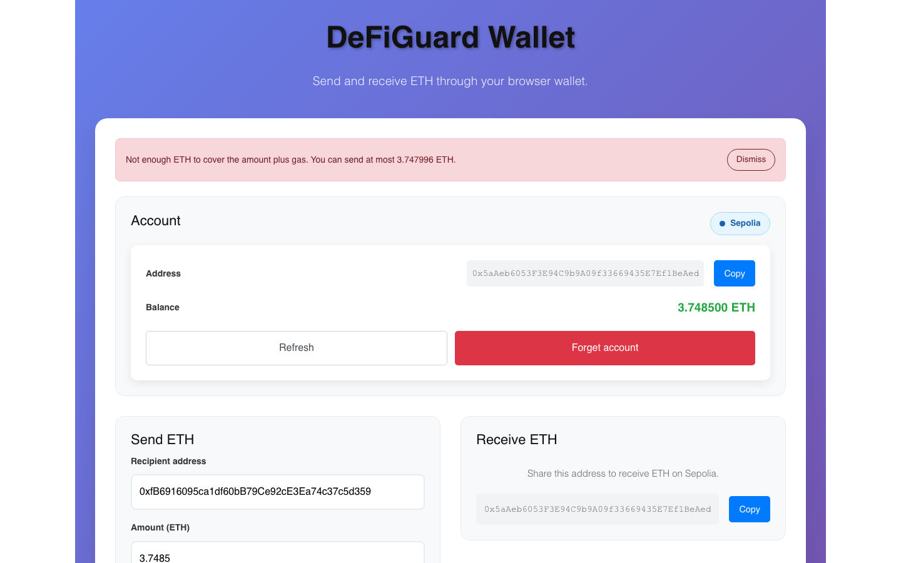
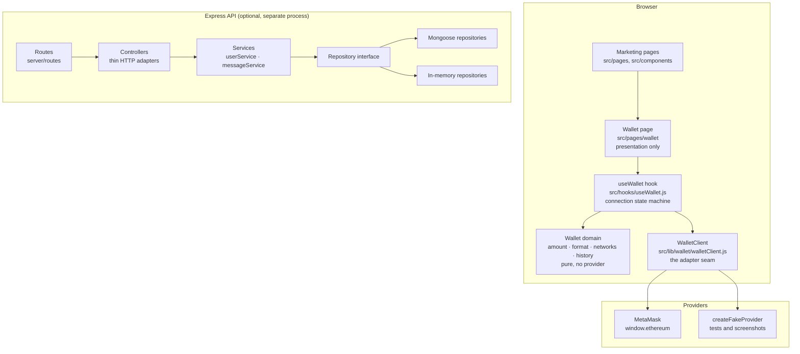
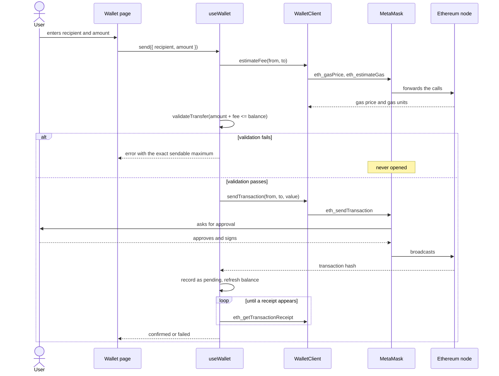

# DeFiGuard

A browser wallet interface for Ethereum: connect an injected EIP-1193 wallet such as
MetaMask, see your balance and network, send ETH with the gas cost checked before the
wallet is asked to sign, and keep a local record of what you sent. It ships inside a
small React marketing site, and a separate Express API provides account and messaging
endpoints that the wallet itself does not depend on.

No private key, seed phrase or mnemonic exists anywhere in this project. Transactions are
handed unsigned to the wallet extension, which signs them after the user approves.

## Screenshots

All four were captured with Playwright at 1440x900 by
`scripts/capture-screenshots.mjs`, which drives the real application against a fake
EIP-1193 provider injected into the page. The provider answers the same JSON-RPC methods
MetaMask does; it signs nothing and reaches no network. The transactions in the history
table were produced by actually filling in and submitting the form.

### Wallet, connected



### Transaction history

One transaction confirmed from its receipt, one still pending.



### The gas check

Sending the entire balance is refused before the wallet is opened, with the exact
sendable maximum. The account holds 3.7485 ETH and gas for a transfer is 21000 units at
24 gwei, so 3.747996 ETH is what actually fits.



### The site the wallet lives in


Real API output — every status code and response body verbatim — is in
[`docs/api-session.txt`](docs/api-session.txt).

## Architecture

Ports and adapters. The React page talks to a hook, the hook talks to a `WalletClient`,
and the client talks to whatever EIP-1193 provider it was given. Nothing above the client
knows whether that provider is MetaMask or a fake, which is what makes the wallet
testable without a browser extension or a chain.

The API is layered the same way: HTTP controllers call services, services call repository
interfaces, and the repositories have both a Mongoose implementation and an in-memory one.



## Sending ETH

The important part of this flow is that the transfer is priced *before* it is validated.
Checking `amount <= balance` passes for a user who types their whole balance in, and the
transaction then fails at the node after they have already approved it.



## Quickstart

```bash
npm install
cp .env.example .env     # optional; the API runs without it
npm start                # API on :3003, web app on :3000
```

Open <http://localhost:3000/wallet>. With no wallet extension installed the page says so
and offers a download link; it does not render a dead "Connect" button.

To run only the front end: `npm run start-front`. Only the API: `npm run start-server`.

## Configuration

Every value is read in `server/config/index.js`. Nothing here has a secret as its default.

| Variable | Required | Default | Purpose |
| --- | --- | --- | --- |
| `API_PORT` | no | `3003` | Port the API listens on. Prefer this over `PORT`: `npm start` runs the React dev server in the same shell and `react-scripts` reads `PORT` too. |
| `PORT` | no | `3003` | Fallback for `API_PORT`, and the port `react-scripts` serves the dev server on. A non-numeric value fails at startup rather than listening on `NaN`. |
| `MONGO_URL` | no | _(unset)_ | MongoDB connection string. Unset means in-memory storage: every route works, nothing persists across a restart. |
| `JWT_SECRET` | for auth | _(unset)_ | Signs and verifies JWTs. Deliberately has no fallback — without it the authenticated routes answer `503`, rather than signing with a guessable development key. |
| `JWT_EXPIRES_IN` | no | `1d` | Token lifetime, in the format `jsonwebtoken` accepts. |
| `CORS_ORIGIN` | no | `http://localhost:3000` | Comma-separated list of browser origins allowed to call the API. |
| `BCRYPT_ROUNDS` | no | `10` | bcrypt work factor. |
| `STATIC_DIR` | no | _(unset)_ | Directory holding the built SPA. Set to `/app/build` in the container image so one process serves both the API and the front end. |
| `NODE_ENV` | no | `development` | Standard Node environment flag. |

The wallet itself needs no configuration: it uses whatever chain the user's wallet is
connected to, so there is no RPC URL to set and no key material to supply.

## Development

```bash
npm start            # API and web app together
npm test             # both suites: 172 tests, no network, no chain access
npm run test:web     # React and wallet domain tests (105)
npm run test:server  # API tests over supertest and in-memory repositories (67)
npm run test:watch   # interactive
npm run lint         # eslint, zero warnings tolerated
npm run format       # prettier --check
npm run build        # production bundle
```

Re-capturing the screenshots needs a Chromium build for Playwright:

```bash
npx playwright install chromium
npm run start-front                    # leave running
PORT=8650 node scripts/capture-screenshots.mjs
```

No test in either suite makes a network request, touches a database, or can sign or
broadcast a real transaction. The fake provider in `src/lib/wallet/testing/` has no key
material and no transport.

## Project structure

```
src/
  lib/wallet/            The wallet domain. No React, no components.
    walletClient.js      EIP-1193 adapter — the seam a new provider plugs into
    metaMask.js          Detects window.ethereum and wraps it
    amount.js            Parsing and the amount-plus-gas rule, in BigInt
    format.js            wei -> display strings, never via a float
    networks.js          chain id -> name, testnet or not
    history.js           Bounded local transaction log, scoped per account+chain
    testing/             Fake provider and memory storage, for tests and screenshots
  hooks/useWallet.js     Connection state machine, provider events, receipt polling
  pages/wallet/          The wallet screen — presentation only
  pages/, components/    The marketing site
  components/icons/      The four icons, inline SVG

server/
  app.js                 Builds the Express app; no listen(), fully injectable
  index.js               Process wiring: config, database, sockets, shutdown
  config/                Every environment-dependent value, in one place
  routes/                Route tables only
  controllers/           Request in, service call, status code out
  services/              All the business rules
  repositories/          Mongoose and in-memory implementations of one interface
  models/                Mongoose schemas
  db/                    Optional MongoDB connection
  middleware/            Auth guard, async wrapper, error handling
  realtime/presence.js   Socket.IO presence and relay
  __tests__/             Supertest-driven API tests

docs/
  api-session.txt        Real captured API output
  screenshots/           Real captured screenshots
scripts/
  capture-screenshots.mjs
```

## Design notes

**The seam is the provider, not the library.** `WalletClient` takes an EIP-1193 provider
and speaks raw JSON-RPC to it. A WalletConnect session, a Ledger bridge or a fake is the
same object shape, so adding one touches no component. That is also what makes the page
testable: `src/pages/wallet/__tests__` drives the shipped page, hook and client against
`createFakeProvider()` — nothing inside the application is mocked.

**web3.js is kept for exactly one job.** Address validation needs a keccak checksum, so
`Web3.utils.isAddress` does that. Balances and amounts go through BigInt instead: an
ether value is routinely larger than `Number.MAX_SAFE_INTEGER` in wei, and the original
page's `parseFloat(balance).toFixed(4)` rendered a dust balance as a flat `0.0000`.

**Correctness before the wallet opens.** Amount parsing rejects anything that is not a
plain decimal with at most 18 places, rejects zero, and checks `amount + estimated fee`
against the balance — with a message naming the exact maximum. `src/lib/wallet/amount.js`
is pure, which is why it can be covered exhaustively in 30 assertions.

**Follow the wallet, do not cache it.** `accountsChanged` and `chainChanged` are
subscribed to, so switching account or network in MetaMask updates the page instead of
leaving a stale account in the `from` field of the next transfer. The connected chain is
always on screen, because sending on the wrong network is how funds get lost in an
interface like this one.

**Bundle size was the real front-end bottleneck**, and it was measured, not guessed
(`npm run build`, gzip figures):

| Change | Before | After |
| --- | --- | --- |
| Main JS bundle (every visitor) | 267.48 kB | 126.89 kB |
| CSS | 58.69 kB | 35.69 kB |
| Static media in `build/` | 4.2 MB | 488 kB |

The wallet route is `React.lazy`-loaded, so web3.js (137 kB gzip) is fetched only by
visitors who open `/wallet`. Font Awesome was pulling roughly a megabyte of webfonts for
four glyphs, which are now inline SVG. The hero and feature backgrounds were 2.4 MB of
PNG for photographic content and are now JPEG. Eighteen vendored stylesheets and their
six source maps — 1.8 MB, with every `@import` for them already commented out — were
deleted.

**The API's bottleneck was unbounded reads.** `User.find()` returned every row and the
conversation query loaded an entire message history on each open; both are paged now,
with the page size clamped server-side rather than trusted from the request. Identity
comes from a verified bearer token instead of a URL parameter, so `/allusers/:id` and
`/setavatar/:id` are no longer "edit the URL, read someone else's account".

**Extensibility, concretely.** The one seam worth building was the provider interface. The
repository interface is the second, and it earns its place immediately: it is what lets
the whole API run — and be tested — without MongoDB, and what makes `MONGO_URL` optional
instead of fatal.

## Limitations

- **No QR code.** The receive card shows the address and a copy button. The original
  placeholder was an empty dashed box labelled "QR Code"; an honest address beats a fake
  image.
- **Transaction history is local to the browser.** It records sends made from this
  interface, in `localStorage`, scoped to one account on one chain and capped at 25
  entries. It is not a chain index: transfers made elsewhere do not appear, and clearing
  site data clears it. The chain is the authority.
- **Legacy gas only.** Transfers are sent with `eth_gasPrice` and a gas limit, not an
  EIP-1559 `maxFeePerGas`/`maxPriorityFeePerGas` pair. Wallets fill those in, but the
  fee shown in the shortfall message is a legacy-style estimate.
- **ETH only.** No ERC-20 transfers, no token balances, no contract interaction.
- **The Express API is not part of the wallet flow.** It is account and messaging
  scaffolding that came with the original tree. It is now correct, layered and tested,
  but the wallet page never calls it, and the marketing pages are static.
- **The contact form does not send mail.** It acknowledges the submission in place and
  says so, rather than showing an `alert('Form submitted!')` for a message that went
  nowhere.
- **Docker images are authored but unbuilt.** `docker compose config` parses; the images
  have not been built or booted in this environment.

## Docker

```bash
JWT_SECRET=$(node -e "console.log(require('crypto').randomBytes(48).toString('hex'))") \
  docker compose up --build
```

The stack is a four-stage build — dependencies, React build, production dependencies,
runtime — producing an image that contains no `react-scripts`, no webpack and no test
tooling. It runs as the unprivileged `node` user under `tini`, so the graceful shutdown
in `server/index.js` receives `SIGTERM`, and has a `HEALTHCHECK` against `/health`. The
app is published on <http://localhost:8650>; MongoDB is reachable only on the compose
network.

## Licence

Apache-2.0. See [LICENSE](LICENSE).
